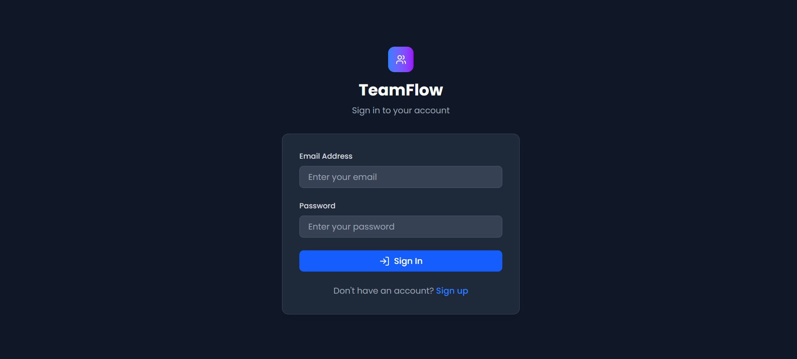
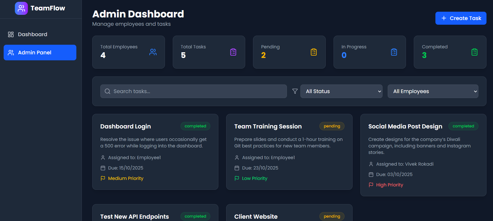
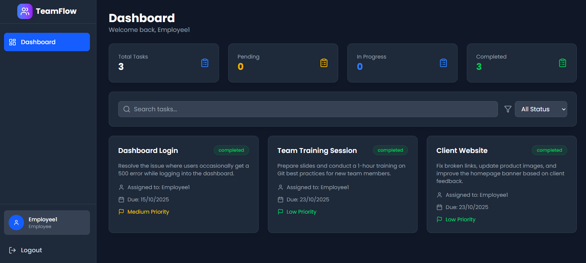

# TeamFlow Frontend - Employee Task Management System 🚀

A modern, responsive **React.js frontend** for **TeamFlow** – a comprehensive employee task management system. Features a beautiful dark-themed UI, role-based dashboards, and seamless user experience.

---

## 🌐 Live Demo
🔗 [Live Application](https://teamflow-vr.vercel.app/)

---

## 📸 Demo

### 🔐 Login & Authentication
  
Secure **JWT-based authentication** with role-based access.

### 🛠 Admin Dashboard
  
Comprehensive admin panel for **managing employees and tasks**.

### 👩‍💻 Employee Dashboard
  
Clean interface for employees to **view and update their tasks**.

---

## ✨ Features

### 🎨 User Interface
- ✅ Modern **dark-themed design** with TailwindCSS  
- ✅ Fully **responsive across all devices**  
- ✅ Smooth **animations and transitions**  
- ✅ Intuitive **navigation and layout**  

### 🔐 Authentication
- ✅ **JWT-based** login/logout  
- ✅ **Protected routes** with role-based access  
- ✅ Persistent sessions with **localStorage**  
- ✅ Automatic **token refresh**  

### 👨‍💼 Admin Dashboard
- ✅ View all employees  
- ✅ Create, assign, and manage tasks  
- ✅ Advanced **task filtering and search**  
- ✅ Real-time **task status monitoring**  
- ✅ Employee management capabilities  

### 👩‍💻 Employee Dashboard
- ✅ View assigned tasks with due dates  
- ✅ Update task status (**Pending → In Progress → Completed**)   
- ✅ Task filtering and search functionality  
- ✅ Priority-based task organization  

---

## 🛠 Tech Stack

### Frontend  
  
  
  
  

### State Management & API  
  
  

### Deployment  
  

---
